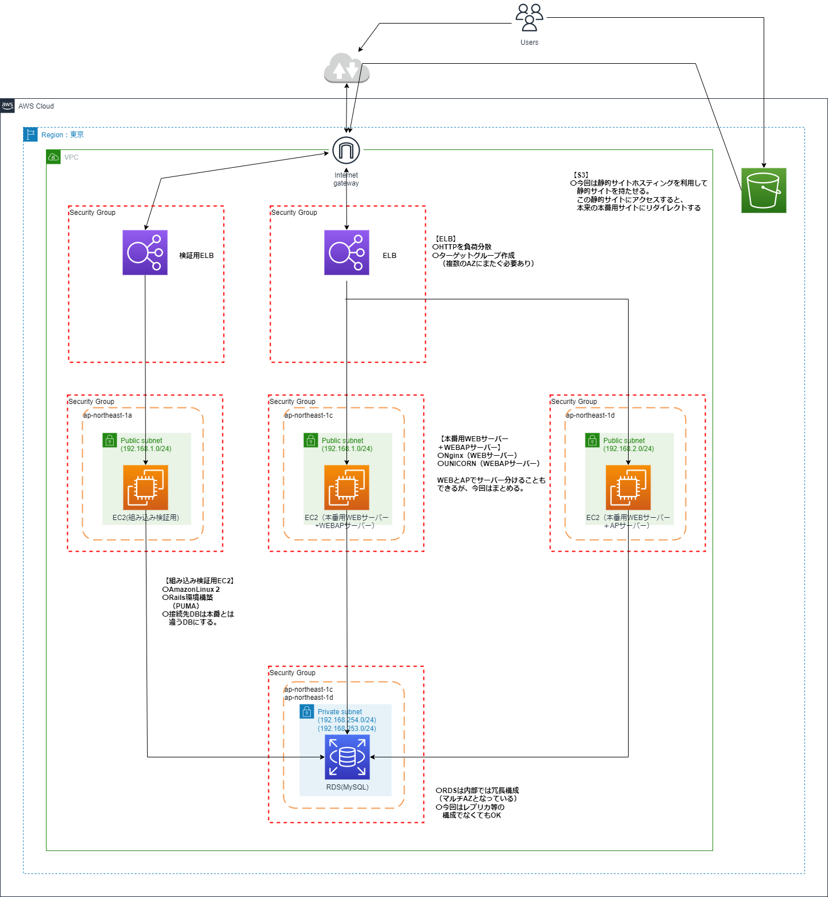

---
# 第5回目講義について
---

### 1.　インフラ構成図
*下記構成図参照  

### 2.　検証環境接続

* 正常動作確認  
  
  
  
* 異常系動作確認  
  
  

### 3.本番環境接続

* 正常動作確認  
  
  

* 異常系動作確認  
**1台が停止しても問題なく接続可能**  
  
  

### 4.S3の扱い

**今回は静的サイトホスティングを利用して静的サイトを持たせる。**  
  この静的サイトにアクセスすると、  
  本来の本番用サイトにリダイレクトする
  
### 第5回目の学び

1. やはりアプリ面の学習も必要に感じた。  
サーバー側が構築できてもアプリ側のエラーで止まってしまうことがあった。  
2. ログにはしっかり情報が主t力されているので、  
確認はしっかりした方が良い。
3.　Windows系が多かったので、Linuxに早く慣れたい。